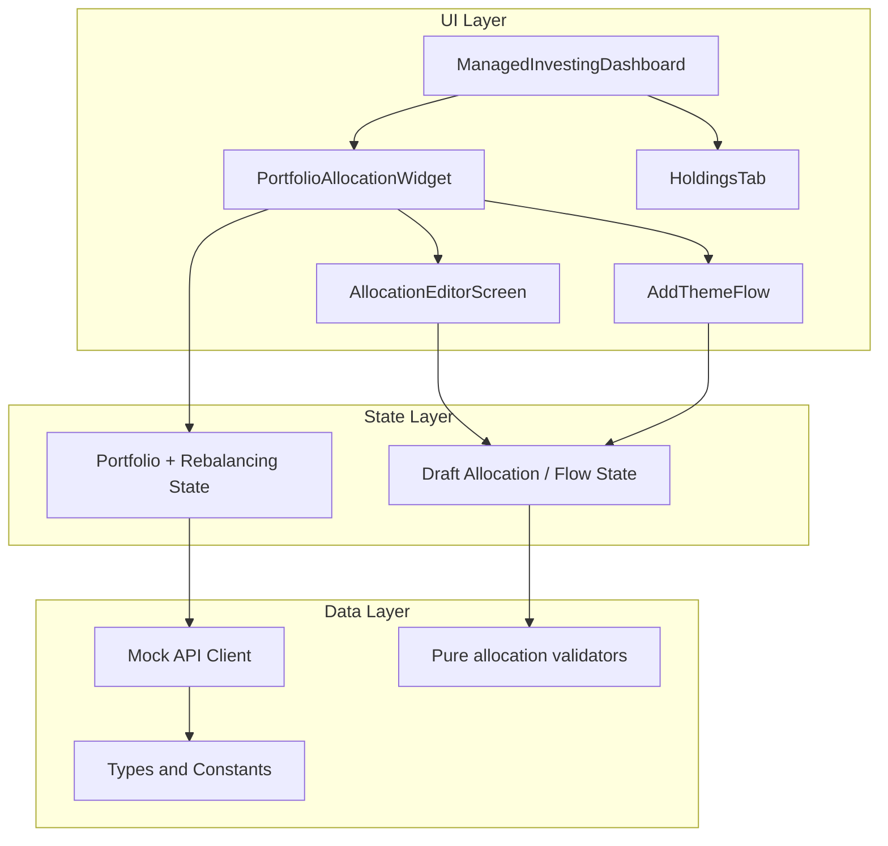

# Managed Investing Portfolio Allocation — Prototype Execution Plan

**Sources of truth:** [spec.md](spec.md) for data models, component names, flows, API contracts, and business rules. **Visual reference only:** [assets/Section_1-a2a5dad6-dce3-46fd-b8a2-45d6e68ed0ee.png](assets/Section_1-a2a5dad6-dce3-46fd-b8a2-45d6e68ed0ee.png) (Section_1) — teal `#1D9E75`, typography, card radius, bottom-sheet patterns.

**Repo reality:** There is no application code yet (only `spec.md` and `/docs`). The roadmap assumes introducing a small SPA (e.g. Vite + React + TypeScript) unless you standardize on another stack; the **order of work** below is stack-agnostic at the logic layer.

---

## 1. System overview

### High-level architecture

- **UI:** Screens and components exactly as named in spec §3–4.
- **State:** Canonical `ManagedInvestingPortfolio` from mock `GET /portfolio`; ephemeral **draft** state for editor and add-flow steps until confirm posts to mock `POST /allocation`.
- **Data:** TypeScript interfaces from spec §2; `THEME_CATALOGUE` / `ALLOCATION_PRESETS` as static modules; mock handlers simulate success, `REBALANCE_IN_PROGRESS`, `INVALID_ALLOCATION`, and optional delayed completion for polling demos.

### Key screens and navigation

| From | Action | To |
|------|--------|-----|
| Dashboard | Tap **Manage** (hidden if rebalance in progress) | `AllocationEditorScreen` |
| Dashboard | Tap **Add a theme (N of 3)** | `ThemeCatalogueScreen` (start of Add Theme flow) |
| `AllocationEditorScreen` | **Update portfolio** (valid + changed) | `AllocationConfirmScreen` (action: `edit`) |
| Add flow | After theme chosen | `AllocationPickerScreen` → **Continue** → `AllocationConfirmScreen` (action: `add`) |
| `AllocationEditorScreen` | **Remove** on theme row | `ConfirmationBottomSheet` (remove) → on confirm → POST without theme → rebalance UI |
| Dashboard / Core area | Navigate to holdings (per your shell routing) | `HoldingsTab` with `OverlapTags` |

Implement routing with a minimal route map (e.g. `/managed-investing`, `/allocation-editor`, `/add-theme`, `/add-theme/pick`, `/allocation-confirm`, `/holdings`) or stacked modals if you prefer native-like full-screen modals — **decide once** when scaffolding.

---

## 2. Component mapping (spec → screens)

| Spec component | Primary screen / parent |
|----------------|----------------------|
| **PortfolioAllocationWidget** | `ManagedInvestingDashboard` — section “My portfolio”, Manage link, donut, legend, add CTA, rebalance banner |
| **PortfolioDonut** | Inside widget; also preview variants in preset picker / confirm (spec: mini donut on presets; full on confirm) |
| **SegmentLegend** | Widget; optionally echoed on confirm breakdown |
| **AddThemeButton** | Widget only (`themes.length < 3` and no active rebalance) |
| **RebalancingBanner** | Widget when `rebalancingState.status === 'in_progress'` (and failed/delayed copy per §4.4) |
| **AllocationEditorScreen** | Full screen after **Manage** — `AllocationDonutPreview`, theme list + Remove, `AllocationPresetPicker`, `CustomAllocationInputs`, core remainder label, **Update portfolio** |
| **AllocationDonutPreview** | Editor + confirm + picker (live preview) |
| **AllocationPresetPicker** | Editor + **AllocationPickerScreen** (add flow reuse) |
| **CustomAllocationInputs** | Editor only (custom mode + optional “Advanced” per spec §4.5) |
| **AllocationSummary + ConfirmButton** | Map to **AllocationConfirmScreen** (spec §4.8) — single review step with Confirm/Cancel |
| **AddThemeFlow** | `ThemeCatalogueScreen` → `ThemeDetailDrawer` → `AllocationPickerScreen` → `AllocationConfirmScreen` |
| **ThemeCard** | Catalogue list |
| **ThemeDetailDrawer** | Bottom sheet from **Details** on card |
| **Remove Theme** | Not a separate route: **ConfirmationBottomSheet** from editor (spec §6.3) |
| **HoldingsTab** | Separate tab/screen; **HoldingRow** + **OverlapTags**; helper copy when any overlap |

---

## 3. State architecture plan

### Global vs local

| Concern | Scope | Notes |
|--------|--------|--------|
| `ManagedInvestingPortfolio` (server-shaped) | **Global** (Context, Redux, or Zustand) | Single source after fetch / successful POST |
| `rebalancingState` + optimistic “pending” donut | **Global** | On confirm success: set portfolio + `rebalancingState.in_progress`; donut uses target allocation + `isPending` per spec §4.1 |
| Mock polling timer / “complete after X” for demo | **Global side effect** | Stub 6h as a short interval in dev only, or manual “Simulate complete” for QA |
| Editor draft: preset vs custom, per-theme %, “advanced” expanded | **Local to editor** (or URL + sessionStorage if you need deep links) | Reset on open from latest `portfolio` |
| Add-flow draft: selected `themeId`, preset choice | **Local to flow** | Cleared on cancel or after successful confirm |
| Bottom sheet open IDs (detail drawer, remove confirm) | **Local UI** | Focus trap + Esc per spec §9 |

### Allocation state flow (core + themes)

1. **Read path:** `GET` populates `coreAllocation` + `themes[]`; **display** core pct as `coreAllocation.targetPct` (or derive `100 - sum(themes)` and assert consistency in dev).
2. **Edit path:** User adjusts presets or custom theme %; **derived** `corePct = 100 - sum(theme targetPcts)` always; never store user-edited core.
3. **Submit path:** Build `POST` body `{ themes: [{ themeId, targetPct }] }` only; mock returns portfolio with `rebalancingState` and `targetAllocation`.
4. **Rebalancing UI:** Widget reads `rebalancingState.targetAllocation` for donut segments + “pending”; hide Manage / Add.

### Rebalancing lock state

- **Derive** `isRebalanceLocked = portfolio.rebalancingState?.status === 'in_progress'`.
- All CTAs: Manage, Add theme, editor inputs, confirm — **disabled or hidden** per spec §4.1 and §7.
- API errors: `REBALANCE_IN_PROGRESS` toast; keep UI unchanged.

---

## 4. Business rules enforcement plan

| Rule | Where enforced | How |
|------|----------------|-----|
| **Core auto-calculation** | Pure function module + UI | `computeCorePct(themePcts: number[]): number` → `100 - sum`; editor shows read-only line; POST omits core (spec §5.2) |
| **Min 5% per theme** | Validator + inputs | Clamp or step inputs to 5% increments; if &lt; 5 show spec copy (§8); disable Confirm / Update portfolio |
| **Max 3 themes** | Catalogue + widget | Hide `AddThemeButton` at 3; disable add with tooltip on cards; server array max 3 in mock |
| **Themes sum ≤ 95% (core min 5%)** | Validator | `sum(themes) <= 95`; red counter “{total}% assigned — {remainder}% remaining” when invalid (§4.5) |
| **Core not user-editable** | UI | No slider/input for core in editor; spec differs slightly from Section_1 dual sliders — **follow spec** for prototype |
| **Risk eligibility** (`future_innovation`) | Catalogue | Compare `userRiskLevel` to `eligibleRiskLevels`; disable Add + copy per §4.7; mock 400 `INVALID_ALLOCATION` optional |
| **Rebalancing lock** | Global flag | Hide Manage/Add; read-only widget; block navigation to editor or show banner-only |
| **No dollar values except total** | Donut center on dashboard only | Segment legend and allocation flows: **% only** (§4.2, §4.3, §7); confirm screen breakdown: % only |
| **Optimistic pending donut** | After successful POST | Set segments from `targetAllocation`; `isPending: true` until poll clears state (§7) |

---

## 5. Screen-by-screen build plan

### A. Dashboard — `PortfolioAllocationWidget`

- **Purpose:** Unified blended portfolio summary; entry to manage / add theme; rebalance messaging.
- **Components:** `PortfolioDonut`, `SegmentLegend`, `AddThemeButton`, `RebalancingBanner`, header + Manage.
- **State:** Reads global `portfolio`; `isRebalanceLocked` drives visibility; donut uses **target** segments + pending when rebalancing.
- **Edge cases:** 0 themes (solid ring); 3 themes (no add); $0 total (spec §8 — placeholder ring); pending label (amber).

### B. `AllocationEditorScreen`

- **Purpose:** Edit presets/custom theme %; remove themes; navigate to confirm.
- **Components:** `AllocationDonutPreview`, theme rows + Remove, `AllocationPresetPicker`, `CustomAllocationInputs`, core remainder text, Update CTA.
- **State:** Initialize draft from `portfolio`; track `dirty` vs server; validation drives CTA disabled.
- **Edge cases:** Custom sum ≠ total; per-theme &lt; 5%; no themes (core-only) still allows preset path for “add” via separate flow; remove last theme via remove sheet → POST `themes: []`.

### C. Add Theme flow

- **Purpose:** Pick eligible theme, set allocation preset, confirm.
- **Screens:** `ThemeCatalogueScreen` → `ThemeDetailDrawer` → `AllocationPickerScreen` → `AllocationConfirmScreen`.
- **State:** `selectedThemeId`, `activeThemeIds` from portfolio; draft preset; merge new theme into preview on confirm payload.
- **Edge cases:** Already active; ineligible risk; 3 themes; first theme copy on confirm (§4.8).

### D. Remove Theme flow

- **Purpose:** Confirm removal; POST updated `themes` without removed id.
- **Components:** `ConfirmationBottomSheet` only (spec §6.3).
- **State:** Which `themeId` is targeted; on confirm build new themes array; optional skip confirm for zero themes edge.
- **Edge cases:** User taps Keep it; destructive styling on Remove.

### E. `HoldingsTab` — overlap tagging

- **Purpose:** Show which segment each ETF belongs to; educate on overlap.
- **Components:** `HoldingRow`, `OverlapTags`; conditional helper text.
- **State:** Mock holdings list with `segments: ('core' \| ThemeId)[]` per spec §4.9 until backend field exists (spec §12 Q3).
- **Edge cases:** Single segment → no tags; many overlaps → multiple pills; tap row → detail sheet listing segments.

---

## 6. Implementation order (strict roadmap for Agent Mode)

Build **bottom-up**: types and pure logic → mock API → global state → primitives → composite widget → editor → shared confirm → add flow → remove sheet → holdings → a11y/analytics stubs → polish.

| Step | Deliverable | Dependency |
|------|-------------|------------|
| **1** | Repo scaffold (package manager, TS, linter, test runner optional), env placeholder | — |
| **2** | `types/portfolio.ts` — all interfaces from spec §2.1–2.3 + `DonutSegment`, API DTOs | — |
| **3** | `constants/themeCatalogue.ts`, `constants/allocationPresets.ts` — copy from spec §2.2–2.3 | Step 2 |
| **4** | `lib/allocation.ts` — `computeCorePct`, `validateThemePcts`, `splitPresetAcrossThemes`, risk eligibility helper | Steps 2–3 |
| **5** | `lib/mockPortfolioStore.ts` or MSW handlers — `GET /v1/managed-investing/portfolio`, `POST .../allocation`, `GET .../rebalancing-status` with scripted responses | Steps 2–4 |
| **6** | Global `PortfolioProvider` (or store) — fetch on mount, `updateAllocation`, `refreshPortfolio`, `simulateRebalanceComplete` for demo | Step 5 |
| **7** | **Presentation primitives:** SVG `PortfolioDonut` / `AllocationDonutPreview` (gaps, min segment width, `aria-label`), `SegmentLegend` row, `RebalancingBanner`, shared `Card` / typography tokens using **#1D9E75** + Section_1 spacing | Steps 2, 4 |
| **8** | **`PortfolioAllocationWidget`** on dashboard — wires Steps 6–7; all widget variants + lock rules | Steps 6–7 |
| **9** | **`AllocationPresetPicker`** + mini donut (isolated) | Steps 4, 7 |
| **10** | **`CustomAllocationInputs`** + assignment counter / errors | Steps 4, 9 |
| **11** | **`AllocationEditorScreen`** — compose 9–10, remove buttons, Update disabled logic, navigation to confirm | Steps 6, 9–10 |
| **12** | **`AllocationConfirmScreen`** — props: `action`, `targetPortfolio` snapshot, disclosures, Confirm → POST + optimistic pending + error toasts | Steps 6, 7, 11 |
| **13** | Wire editor **Update portfolio** → Step 12 | Steps 11–12 |
| **14** | **`ThemeDetailDrawer`** (bottom sheet shell: handle, overlay, focus trap) | Step 7 |
| **15** | **`ThemeCatalogueScreen`** + `ThemeCard` — eligibility + disabled states | Steps 3, 6, 14 |
| **16** | **`AllocationPickerScreen`** — reuse picker from Step 9; default Balanced for first theme | Steps 9, 15 |
| **17** | Connect Add flow: catalogue → picker → **AllocationConfirmScreen** (`action: 'add'`) | Steps 12, 15–16 |
| **18** | **`ConfirmationBottomSheet`** for remove — copy from §6.3; POST from editor | Steps 11–12, 14 |
| **19** | **`HoldingsTab`** — mock data + `OverlapTags` + helper + optional detail sheet | Steps 2–3 |
| **20** | **Accessibility pass:** `aria-live` on banner, `aria-label` on Remove, sheet Esc | Prior screens |
| **21** | **`track()` stubs** for events in spec §10 | Touchpoints from 8–19 |
| **22** | **Visual QA** against Section_1 (cards, sheets, teal); align tokens with [docs/MLDS-4_0-Reference.md](docs/MLDS-4_0-Reference.md) when it conflicts with nothing in spec | All UI |

**Critical sequencing notes**

- Do **not** build Add/Remove flows before **`AllocationConfirmScreen`** and mock POST exist, or you will duplicate confirm logic.
- Implement **`ConfirmationBottomSheet`** once (Step 14) and reuse for theme details vs remove to save time.
- **Holdings** can run in parallel after Step 7 if staffed; strictly after types (Step 2) for `HoldingRowProps`.

---

## Pre-implementation checklist (non-code)

- Confirm **routing vs modal** pattern for editor and add flow.
- If `design-system.md` is added later per [.cursor/rules/project-context-rule.mdc](.cursor/rules/project-context-rule.mdc), map tokens once and replace ad-hoc Section_1 values where MLDS defines equivalents.
- Prototype **polling**: use dev-only short interval or button to complete rebalance so the “unlock” path is demonstrable without waiting 6 hours.

This sequence satisfies: **dependencies first → reusable logic (`lib/`, mocks) before UI → composite flows last.**
